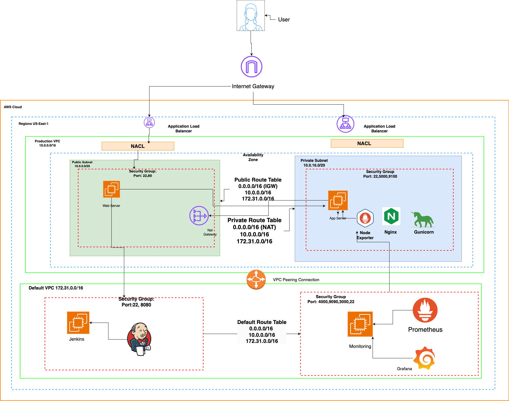

# Microblog VPC Deployment - Documentation

## Purpose
This workload focuses on deploying an application within a custom AWS VPC using EC2 instances for Jenkins, web, and application servers. The goal is to implement a scalable infrastructure, manage server communication securely, and automate deployment pipelines using Jenkins.

## Steps Taken

1. **VPC Setup:**
   - **Why:** Provides network isolation, enhancing security and control.
   - Created a custom VPC with a public and private subnet, including NAT Gateway.
  -  In the AWS console, created a custom VPC with one availability zone, a public and a private subnet, a NAT Gateway in 1 AZ and no VPC endpoints.  
  - Navigate to subnets and edit the settings of the public subet you created to auto assign public IPv4 addresses.
  - In the Default VPC, create an EC2 t3.medium called "Jenkins" and install Jenkins onto it. 

2. **EC2 Instance Setup:**
   - **Why:** Segregates services and roles, improving security and management.
   - Created instances for Jenkins (t3.medium), Web Server (t3.micro), and Application Server (t3.micro).
   - Create an EC2 t3.micro called "Web_Server" In the PUBLIC SUBNET of the Custom VPC, and create a security group with ports 22 and 80 open.  
   - Create an EC2 t3.micro called "Application_Server" in the PRIVATE SUBNET of the Custom VPC,  and create a security group with ports 22 and 5000 open. Make sure you create and save the key pair to your local machine.

3. **Key Authentication:**
   - **Why:** Establishes secure communication between servers.
   - Generated an SSH key on Jenkins, sharing it with the Web Server to enable secure access.

4. **Nginx Configuration:**
   - **Why:** Acts as a reverse proxy to forward traffic from the Web Server to the Application Server.
   - Configured Nginx to forward requests to the private IP of the Application Server.

5. **Script Creation:**
   - **start_app.sh** (Application Server): Sets up the Flask application with dependencies, environment variables, and runs it using Gunicorn.
   - **setup.sh** (Web Server): Remotely runs `start_app.sh` via SSH.
   
   **Why:** Automates application deployment, reducing manual intervention.

6. **Jenkins Pipeline:**
   - **Why:** Automates build, test, and deployment processes.
   - Created a Jenkinsfile to build, test (pytest), and deploy the application by running scripts on the Web and Application Servers.

7. **Monitoring Setup:**
   - **Why:** Tracks performance and health of the system.
   - Set up Prometheus and Grafana to monitor the Application Server.

## System Design Diagram

## Issues/Troubleshooting
- **Key Pair Issues:** SSH permission errors were resolved by copying the Application Server key to the Web Server.
- **Nginx Configuration Errors:** Debugged using `nginx -t` and log files to ensure proper proxy setup.

## Optimization
- **Separation of Environments:** Allows testing in a non-production environment, mitigating risk. The current setup addresses this by using different servers for Jenkins, the web, and the application.
- **Improvements:** Consider auto-scaling and load balancing for better resilience and optimizing cost.

## Conclusion
This workload demonstrates the process of building and automating an application deployment within a secure, scalable AWS environment. By separating roles, automating processes, and integrating monitoring, it provides a foundation for more advanced deployments in real-world scenarios.